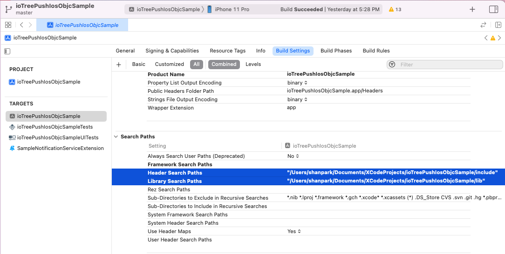
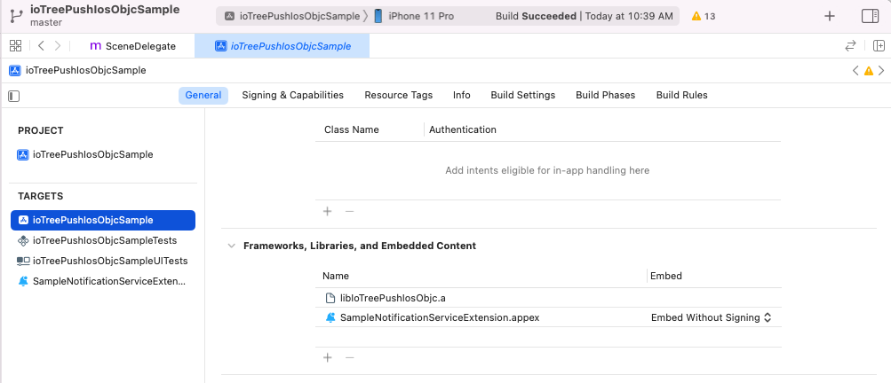
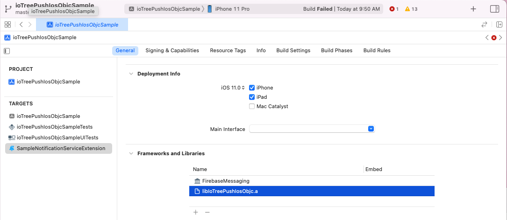

# iOS SDK 사용 가이드

- iOS용 SDK는 현재 Firebase 8.7.0 버전 Dependency를 갖지만 추후에 상황에 따라 버전을 맞춰야 할 필요가 있다면 감안하여 버전을 맞춰서 배포하도록 한다.
  - 8.7.0 ~ 8.15.0 확인 완료.
- 아래 형태로 배포된다.
  - **Swift**: Swift Package Manager를 통해서 배포
  - **Objective-C**: Static library 형태로 배포

## 라이브러리 설정 및 구현 가이드

### 1. ioTreePush를 이용하기 위한 기본 설정 작업이 선행 되어야 한다

- Firebase 프로젝트 생성 및 앱 번들 ID 등록.
- ioTreePush 서버 설정.
- Objective-C의 경우 라이브러리 파일을 받아서 프로젝트 하위 폴더 적당한 위치에 압축 해제.

### 2. 앱 프로젝트 설정

- Target > Signing & Capabilities에서 "Push Notifications"를 등록해준다. (아래 그림 참조)
  

  - Swift

    - 프로젝트 설정의 Swift Packages 탭에 IoTreePushIos 패키지를 등록한다. (아래 그림 참조)
      
    - Location URL은 추후 변경될 수 있으며 등록시 id/password 입력을 요구하면 담당자에게 문의.

  - Objective-C

    - 프로젝트 Targets의 Build Settings 화면에서 Search Paths를 설정해 줘야 한다.
      아래 그림과 같이 앱의 Build Settings > Search Paths를 찾아서 압축 해제한 라이브러리 폴더(lib, include)의 경로를 설정한다.
      
    - 마지막으로 아래 그림과 같이 Target > General 탭에서 Library 등록 섹션을 찾아 libIoTreePushIosObjc.a 라이브러리를 등록한다.
      

### 3. AppDelegate 작성

- 소스 코드 작성 절차는 Swift와 Objective-C가 거의 동일하므로 Swift 기준으로 설명하고 Objective-C는 샘플코드를 참조하도록 한다.
- AppDelegate를 구현한 소스 코드에 IoTreePushIos를 import한다.
- AppDelegate에서 구현하는 메소드는 아래 2가지 이다. 아래 2개 외에 샘플코드에 보이는 2개 메소드는 `IoTreePushDelegate` 프로토콜의 구현이며 나중에 설명하도록 한다.

  - `application:didFinishLaunchingWithOptions:`
  - `application:didRegisterForRemoteNotificationsWithDeviceToken:`

- `application:didFinishLaunchingWithOptions:` 메소드에 ioTreePush 초기화 코드를 작성한다.

  - 토픽을 사용하는 경우 Topic을 subscribe하는 코드를 넣는다.
  - 토큰을 등록하는 코드는 로그인 이후에 실행되어야 하는 경우가 많으므로 앱 시나리오에 따라 다른 곳에서 수행되기도 한다.

- `application:didRegisterForRemoteNotificationsWithDeviceToken:` 메소드는 아래 예시와 같이 IoTreePush.mapToken() 메소드만 호출해주면 된다.

  - Swift

  ```swift
  import IoTreePushIos

  ...

  class AppDelegate: NSObject, UIApplicationDelegate, IoTreePushDelegate {

      // ioTreePush 초기화 코드 구현 샘플.
      func application(_ application: UIApplication,
                      didFinishLaunchingWithOptions launchOptions: [UIApplication.LaunchOptionsKey : Any]? = nil) -> Bool {

          // SDK 초기화
          IoTreePush.initialize(
              application: application,
              appKey: "eb4ba05f2ba256b2a42a6dc026a25ca3d321c53020007bc51067220ee9503ded", // 관리자 문의
              delegate: self, // Optional
              feedbackBaseUrl: "https://nas.iotree.co.kr:8092" // 관리자 문의, Optional
          )

          // 토픽을 사용하는 경우 토픽 수신
          IoTreePush.subscribeTopic("__everyone__") { error in
              if let error = error as NSError? {
                  print("Topic subscription failed. \(error.localizedDescription)")
              } else {
                  print("Topic subscribed.")
              }
          }

          // 여기서 "sampleid"는 하드코딩되어있지만 실제로는 비즈니스 로직에 따라 로그인과 같은 절차를
          // 밟은 후에 얻어지는 사용자 식별자를 사용해야 한다.
          IoTreePush.registerToken(withUserId: "sampleid") { (token, error) in
              if let error = error as NSError? {
                  print("registerToken() failed. \(error.localizedDescription)")
              } else {
                  print("FCM Token: \(token!)")
              }
          }

          return true
      }

      // 토큰 맵핑을 위한 메소드 구현.
      func application(_ application: UIApplication,
                      didRegisterForRemoteNotificationsWithDeviceToken deviceToken: Data) {
          IoTreePush.mapToken(deviceToken);
      }

      // IoTreePushDelegate 구현.
      func onMessage(willPresent data: [AnyHashable : Any], withId: String) {
          print("onMessage:willPresent: \(data)")
      }

      // IoTreePushDelegate 구현.
      func onMessage(didReceive data: [AnyHashable : Any], withId: String) {
          print("onMessage:didReceive: \(data)")
      }
  }
  ```

  - Objective-C

  ```objectivec
  #import <IoTreePush.h> // 적당한 위치에 import

  ...

  @implementation AppDelegate

  - (BOOL)application:(UIApplication *)application didFinishLaunchingWithOptions:(NSDictionary *)launchOptions {

      // SDK 초기화
      [IoTreePush initializeWithApplication:application
                                    appKey:@"eb4ba05f2ba256b2a42a6dc026a25ca3d321c53020007bc51067220ee9503ded"
                                  delegate:self
                            feedbackBaseUrl:@"https://nas.iotree.co.kr:8092"];

      // 여기서 "sampleid"는 하드코딩되어있지만 실제로는 비즈니스 로직에 따라 로그인과 같은 절차를
      // 거친 후에 얻어지는 사용자 식별자를 사용해야 한다.
      [IoTreePush registerTokenWithUserId:@"sampleid"
                                  groups:[NSSet setWithArray: @[@"iOSGroup"]]
                                callback:^(NSString * _Nullable token, NSError * _Nullable error) {
          if (error) {
              NSLog(@"registerTokenWithUserId failed. [%@]", error);
          } else {
              g_token = token;
              NSLog(@"IoTreePush Token: %@", token);
          }
      }];

      // 토픽 수신
      [IoTreePush subscribeTopic:@"__everyone__" withCallback:^(NSError * _Nullable error) {
          if (error) {
              NSLog(@"Topic subscription failed. [%@]", error);
          } else {
              NSLog(@"Topic subscribed.");
          }
      }];

      return YES;
  }

  /// 토큰 맵핑을 위한 메소드 구현.
  - (void)application:(UIApplication *)application didRegisterForRemoteNotificationsWithDeviceToken:(NSData *)deviceToken {
      [IoTreePush mapToken:deviceToken];
  }

  // Foreground 상태에서 메시지를 받으면 호출된다.
  - (void)onMessageWillPresent:(NSDictionary *_Nonnull)data withId:(NSString *_Nonnull)pushId {
      NSLog(@"onMessageWillPresent:withId: - %@", data);
  }

  // Background 상태에서 메시지를 받으면 호출된다.
  - (void)onMessageDidReceive:(NSDictionary *_Nonnull)data withId:(NSString *_Nonnull)pushId {
      NSLog(@"onMessageDidReceive:withId: - %@", data);
  }
  ```

### 4. 수신된 메시지를 전달받기 위한 IoTreePushDelegate 구현 (**Optional**)

푸시 메시지를 수신했을 때 Notification을 보여주는 것 말고는 추가로 해야 하는 작업이 없다면 이 단계는 구현하지 않아도 된다. 메시지를 받아서 추가로 어떤 작업을 수행해야 한다면 `IoTreePushDelegate` 프로토콜을 구현해야 한다.

위 3번의 Sample 코드에서 AppDelegate클래스는 `IoTreePushDelegate` 프로토콜을 구현하고 있다. 마지막의 2개 메소드가 그것이다. 이 두 메소드는 아래 경우에 대하여 호출된다.

- `onMessage(willPresent:withId:)` : 앱이 Foreground 상태에 있을 때 메시지가 수신되면 호출된다. 참고로 이 메소드는 Notification이 뜨기 직전에 호출되는 것이며 사용자가 Notification을 클릭하면 아래 메소드가 다시 호출된다.
- `onMessage(didReceive:withId:)` : 앱이 Background 상태에 있을 때 메시지가 수신되면 화면 상단에 Notification이 뜨고 사용자가 표시된 Notification을 클릭하면 앱이 실행되면서 그 때 이 메소드가 호출된다.

### 5. 수신 알림 처리를 위한 메소드 호출 (**Optional**)

앱이 포그라운드 상태에서 푸시를 수신한 경우 그 메시지는 수신상태로 서버에 알림이 가지만 백그라운드 상태에서 받은 푸시 메시지는 앱 사용자가 푸시 메시지를 클릭하지 않으면 수신으로 인식되지 않는다. 이런 현상을 방지하기 위해서 앱이 Active 상태로 전환되면 항상 아래 메소드를 호출해줘야 한다.

- iOS 버전에 따라서 DidBecomeActive 이벤트를 처리하는 방식이 다르므로 버전/환경에 맞게 적절한 곳에서 아래 메소드를 호출한다.
- 앱의 수신 알림 처리 시나리오가 적용되지 않는 경우 처리할 필요없다.

```swift
    // iOS 버전에 따라 SceneDelegate 또는 AppDelegate의 DidBecomeActive 메소드에서 호출해준다.
    IoTreePush.handleDeliveredNotifications()
```

```objectivec
    // iOS 버전에 따라 SceneDelegate 또는 AppDelegate의 DidBecomeActive 메소드에서 호출해준다.
    [IoTreePush handleDeliveredNotifications];
```

### 6. 이미지가 포함된 메시지 수신을 위한 Extension 추가. (**Optional**)

iOS의 APN은 기본적으로 지원하지 않는다. 이미지를 지원하기 위해서는 Notification Service Extension을 프로젝트에 추가하고 약간의 코드를 넣어주어야 한다.

만약 image를 지원할 필요가 없다면 이 부분은 구현하지 않아도 된다.

- File > New > Target... 메뉴를 눌러서 Notification Service Extension을 추가한다.


- 적당한 이름을 입력하고 Finish를 누르면 Activate하겠냐는 팝업이 뜨는데 'Activate'를 눌러 진행한다.


- 추가가 완료되면 아래 그림과 같은 기본 코드가 생성된다.


- 새로 추가된 Notification Service Extension는 다른 Target이기 때문에 IoTreePushIos 모듈을 여기도 등록 해줘야 한다.

  - Swift의 경우 아래 그림과 같이 Target의 Frameworks and Libraries 항목에 IoTreePushIos 모듈을 등록한다.
    
  - Objective-C의 경우 아래 그림과 같이 Target의 Frameworks and Libraries 항목에 Firebase 패키지의 FirebaseMessaging 모듈과 libIoTreePushIosObjc.a 파일을 등록해준다. Firebase 패키지는 이미 추가되어 있으므로 FirebaseMessaging 모듈과 libIoTreePushIosOjbc.a 를 찾아서 등록만 해주면 된다.
    

- 여기서 새로 등록한 Target의 Deployment Info 설정도 App의 설정과 같은 설정(iOS 버전 등)으로 맞춰주어야 한다.
- 이제 소스를 열어서 IoTreePushIos 모듈을 임포트해주고 첫 번째 메소드의 코드를 아래와 같이 바꿔준다. (샘플 코드 참조)

  - Swift

  ```swift
  import IoTreePushIos

  ...

  override func didReceive(_ request: UNNotificationRequest,
                          withContentHandler contentHandler: @escaping (UNNotificationContent) -> Void) {
      self.contentHandler = contentHandler
      bestAttemptContent = (request.content.mutableCopy() as? UNMutableNotificationContent)

      // 이 if문으로 교체.
      if let bestAttemptContent = bestAttemptContent {
          IoTreePush.populateNotificationContent(bestAttemptContent, withContentHandler:contentHandler)
      }
  }
  ```

  - Objective-C

  ```objectivec
  #import "IoTreePush.h" // 라이브러리 설정 경로에 맞게 import.

  ...

  - (void)didReceiveNotificationRequest:(UNNotificationRequest *)request withContentHandler:(void (^)(UNNotificationContent * _Nonnull))contentHandler {
      self.contentHandler = contentHandler;
      self.bestAttemptContent = [request.content mutableCopy];

      // 아래 코드로 교체.
      [IoTreePush populateNotificationContent:_bestAttemptContent withContentHandler:contentHandler];
  }
  ```

### 7. 토큰 등록을 위한 Push 서버 접속 설정 (**Optional**)

3번 초기화 과정에서 `IoTreePush.initialize()` 메소드를 호출할 때 feedbackBaseUrl로 Push 서버의 주소를 설정한다. 여기서 설정한 주소가 HTTPS라면 서버는 공인 인증서로 설정이 되어야 한다. 만약 Self-signed 인증서를 사용했다면 iOS는 기본적으로 접속을 허용하지 않는다.

그럼에도 불구하고 Self-signed 인증서를 사용하려면 앱에는 Info.plist 파일에 아래 내용을 등록해주어야 한다.

- 아래 코드와 그림을 참고하여 Info.plist 파일을 수정한다.
- 참고로 **'nas.iotree.co.kr'** 부분을 접속할 서버의 도메인 주소나 IP 주소로 바꿔주면 된다.

```
...
<key>NSAppTransportSecurity</key>
<dict>
  <key>NSExceptionDomains</key>
  <dict>
    <key>nas.iotree.co.kr</key>
    <dict>
      <key>NSIncludesSubdomains</key>
      <true/>
      <key>NSTemporaryExceptionAllowsInsecureHTTPLoads</key>
      <true/>
    </dict>
  </dict>
</dict>
...
```


## API 사용 방법

### 공통 사항

- 아래 목록 중에서 몇몇 API들은 callback 파라미터를 갖는다. 이 callback 파라미터들은 모두 비동기 작업이 완료 되면 호출되는 함수들이다.
- callback 함수들은 Error? 타입의 파라메터를 갖는데 이 값으로 실패 여부를 알 수 있다. 즉, error 파라메터가 nil인 경우에만 성공한 것으로 판단하고 그렇지 않은 경우 실패한 것으로 간주한다.
- Swift와 Objective-C는 모두 동일한 기능의 API가 제공되므로 여기서는 Swift 를 기준으로 설명한다.

### SDK 초기화

```swift
public static func initialize(
    application: UIApplication,
    appKey: String,
    delegate: IoTreePushDelegate? = nil,
    feedbackBaseUrl: String? = nil
)
```

- 다른 API를 호출하기 전에 반드시 가장 먼저 호출되어야 한다. 참고로 Firebase가 초기화 되지않았다면 FirebaseApp.configure()를 (내부에서) 호출해준다.
  - application: UIApplication 객체.
  - appKey: 서버로 발급되는 키값으로 서버 관리자에게 문의하여 받을 수 있다.
  - delegate: 메시지 수신을 위한 IoTreePushDelegate 프로토콜 구현 객체. Notification은 알아서 띄워 주므로 추가작업이 필요없다면 nil을 지정한다.
  - feedbackBaseUrl: 앱이 토큰 등록, 수신확인 등의 기능을 수행하기 위해 접속할 푸시 서버의 URL. 서버 관리자에게 문의하여 받을 수 있다. 토큰 등록을 로그인 등의 다른 경로로 수행하고 수신확인 등의 기능이 필요없다면 nil을 지정하여 기능을 disable 시킬 수 있다.

### 토큰 등록

```swift
public static func registerToken(
    withUserId userId: String,
    callback: ((String?, Error?) -> Void)?
)
```

- 사용자의 토큰을 서버에 등록한다.
  - userId: 토큰을 등록할 사용자 식별자.
  - callback: 완료 시 호출되는 콜백 함수.

### 토큰 해제

```swift
public static func unregisterToken(
    withCallback callback: ((Error?) -> Void)?
)
```

- 등록된 토큰을 해제한다. 해제 후에는 더 이상 메시지를 수신할 수 없다.
  - callback: 완료 시 호출되는 콜백 함수.

### Topic 구독

```swift
public static func subscribeTopic(
    _ topic: String,
    withCallback callback: ((Error?) -> Void)?
)
```

- 토픽의 구독을 요청한다. 토픽으로 전송된 모든 메시지를 수신할 수 있다.
  - topic: 구독을 요청할 Topic
  - callback: 완료 시 호출되는 콜백 함수.

### Topic 구독 해제

```swift
public static func unsubscribeTopic(
    _ topic: String,
    withCallback callback: ((Error?) -> Void)?
)
```

- Topic의 구독을 해제한다. 더 이상 해당 Topic으로 전송된 메시지를 수신할 수 없다.
  - topic: 구독을 해제할 Topic
  - callback: 완료 시 호출되는 콜백 함수.

### APNS 토큰 매핑

```swift
public static func mapToken(
    _ deviceToken: Data
)
```

- APNS 토큰을 ioTreePush 토큰에 매핑한다. AppDelegate에서 `application(:didRegisterForRemoteNotificationsWithDeviceToken:)` 메소드를 구현하고 호출해주도록 한다. (**필수**)
  - deviceToken: `application(:didRegisterForRemoteNotificationsWithDeviceToken:)` 전달된 Token data.

### Notification Service Extension 구현

```swift
public static func populateNotificationContent(
    _ content: UNMutableNotificationContent,
    withContentHandler handler: @escaping (UNNotificationContent) -> Void
)
```

- 이미지가 포함된 푸시 메시지 수신을 위해서 Notification Service Extension에서 호출해야 한다.
  - content: 기본 구현 함수로 전달된 값 그대로 전달. (Sample 코드 참조.)
  - handler: 기본 구현 함수로 전달된 값 그대로 전달. (Sample 코드 참조.)
